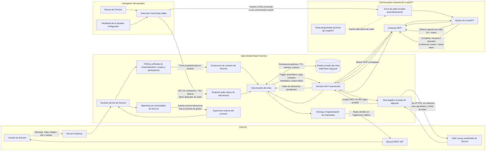

# Arquitectura del relay de ChatGPT

English version: [ChatGPT Relay Architecture](chatgpt-relay-architecture.md)

Este documento describe el relay sin proveedor entre Discord y ChatGPT, sus
fronteras de confianza y las implicaciones de seguridad de conectar una
conversación persistente de ChatGPT al harness mediante MCP.

## Conclusión ejecutiva

El harness **no recibe ni lee automáticamente** el transcript completo de la
conversación de ChatGPT. MCP expone herramientas con argumentos estructurados y
el servidor actual implementa herramientas, no un recurso para exportar el
historial o las conversaciones de ChatGPT.

Sin embargo, no sería correcto afirmar que el contenido de otras conversaciones
de ChatGPT nunca puede filtrarse a través del harness. El modelo puede incluir
cualquier texto disponible en su contexto o memoria dentro de un argumento MCP.
El harness dispone actualmente de herramientas que entregan ese texto a Discord,
incluyendo la finalización del relay y los envíos generales limitados por scope.
El contrato del worker reduce la contaminación accidental entre conversaciones,
pero es una instrucción para el modelo, no una frontera determinista de flujo de
información.

La conclusión práctica es:

- **No hay acceso pasivo al transcript:** el harness actual no puede descargar
  silenciosamente todo el historial de ChatGPT.
- **Puede existir una revelación mediada por el modelo:** ChatGPT puede enviar
  contenido recordado o procedente de turnos anteriores mediante un argumento
  MCP.
- **Existe riesgo si la extensión se compromete:** la implementación actual no
  scrapea mensajes, pero un content script modificado tiene acceso al DOM de las
  páginas de ChatGPT.
- **La retención de OpenAI es una frontera separada:** la memoria, retención y
  uso de datos de ChatGPT dependen de la cuenta y el workspace, no del harness.

## Arquitectura

## Ciclo de vida de un mensaje

1. **Entrada desde Discord.** El harness recibe el evento y evalúa la política
   unificada de comportamiento, el scope, los límites de participación, la
   autorización y el estado de mantenimiento.
2. **Encolado durable.** Con `MODEL_PROVIDER=none`, el harness no llama a ningún
   LLM. Guarda un elemento acotado con el trigger, la identidad de Discord, el
   mensaje referenciado, el contexto reciente y referencias privadas a adjuntos.
3. **Detección de trabajo.** La extensión consulta `wake-status`, que solo devuelve
   contadores e IDs opacos. Las alarmas de Chrome son el mecanismo normal y el
   heartbeat de la pestaña compensa retrasos de Manifest V3.
4. **Activación de ChatGPT.** La extensión inserta un prompt fijo en una
   conversación concreta. Una tarea programada de ChatGPT puede actuar como
   alternativa.
5. **Claim atómico.** ChatGPT llama a `claim_chat_relay_items`. El harness asigna
   cada elemento a un worker y devuelve un lease token.
6. **Contexto autoritativo.** El elemento reclamado identifica el trigger exacto,
   su reply, el contexto acotado, los adjuntos y el relay ID obligatorio.
7. **Obtención de imágenes.** ChatGPT solicita un adjunto por ID e índice. El
   harness resuelve la URL privada, rechaza redirects, valida host y MIME, limita
   tiempo y bytes y devuelve contenido de imagen MCP.
8. **Finalización.** ChatGPT completa, renueva o descarta el elemento exacto. El
   harness vuelve a comprobar la política vigente y divide los textos largos
   antes de enviarlos a Discord.
9. **Recuperación.** El trabajo pendiente sobrevive reinicios, los leases vencidos
   vuelven a `pending`, los fallos de entrega tienen intentos limitados y el TTL
   elimina trabajo antiguo.

## Investigación: ¿puede el harness filtrar conversaciones de ChatGPT?

### Modelo de amenaza

La pregunta contiene cuatro cuestiones diferentes:

1. ¿Puede el servidor MCP leer automáticamente todo el transcript de ChatGPT?
2. ¿Puede ChatGPT incluir voluntaria o accidentalmente contenido anterior en un
   argumento de herramienta?
3. ¿Puede la extensión inspeccionar la página de ChatGPT?
4. ¿Retiene o utiliza OpenAI la conversación independientemente del harness?

### Matriz de evidencia

| Pregunta | Evidencia | Conclusión |
| --- | --- | --- |
| ¿MCP envía automáticamente el transcript completo al harness? | La documentación oficial describe el flujo como descubrimiento, selección de una herramienta, argumentos estructurados y resultado. El servidor actual registra herramientas con schemas y no expone un recurso de historial de ChatGPT. | **No hay evidencia de acceso pasivo al transcript.** El servidor recibe tool calls y argumentos, no un volcado automático. |
| ¿Puede llegar contenido anterior de ChatGPT al harness? | `complete_chat_relay_item`, `submit_chat_relay_reply`, `send_owner_dm` y `send_scoped_discord_message` aceptan strings generados por el modelo. El servidor no puede saber si proceden del elemento de Discord, del turno actual, de un turno anterior o de la memoria de ChatGPT. | **Sí.** El modelo puede revelar contexto anterior mediante un argumento MCP. |
| ¿Puede ese contenido salir del harness? | La finalización del relay envía `reply` al canal que originó el elemento. Las herramientas generales pueden enviar texto a un DM del owner o a scopes autorizados. | **Sí, dentro de destinos de Discord configurados.** El scope limita el destino, no el origen semántico del texto. |
| ¿Expone contenido el endpoint de wake? | `/api/chat-relay/wake-status` devuelve estado, contadores e IDs opacos y usa un token separado del bearer privilegiado. | **No expone contenido.** Sí revela timing y volumen de cola. |
| ¿Scrapea mensajes la extensión actual? | El content script busca el composer, los botones y cuenta elementos de mensajes para confirmar el envío. No recoge texto de mensajes ni manda transcripts al harness. | **No en la implementación revisada.** |
| ¿Podría scrapearlos si fuese comprometida o modificada? | El manifest inyecta un content script en `chatgpt.com` y `chat.openai.com`, por lo que puede inspeccionar el DOM accesible. | **Sí, como riesgo de capacidad.** El código actual no lo hace. |
| ¿Puede ChatGPT traer información de otros chats? | La documentación oficial confirma que la memoria puede transportar contexto de trabajos anteriores a trabajos futuros y que se controla desde Settings. | **Sí, cuando memoria/personalización lo permite.** Una conversación dedicada no es por sí sola una frontera dura. |
| ¿Contiene transcripts de ChatGPT el estado del relay? | `ChatRelayQueue` persiste texto y contexto de Discord, replies, URLs de adjuntos, leases y metadatos. La respuesta enviada por ChatGPT se entrega y el elemento se elimina; no existe un camino para descargar el transcript de ChatGPT. | **No se almacena intencionadamente el transcript completo.** El estado sigue conteniendo datos sensibles de Discord. |
| ¿Los audits normales guardan el cuerpo de los mensajes MCP? | Los eventos actuales guardan destino, estado y longitud, no el cuerpo de salida. | **Normalmente no.** Los objetos de error sin sanitizar podrían incluir detalles del request en algunos fallos. |
| ¿La retención de OpenAI equivale a una filtración del harness? | La guía oficial indica que conectores no sincronizados se procesan transitoriamente, pero siguen aplicando los controles normales de retención. También documenta que la información accedida mediante plugins no se usa para entrenamiento en Business, Enterprise y Edu. | **No.** Es una frontera de confianza distinta. Esa garantía no debe extrapolarse a planes personales sin comprobar sus controles actuales. |

### Evidencia del código

- Herramientas MCP y schemas: [`src/mcp-control-server.js`](../src/mcp-control-server.js)
- Persistencia, leases, contrato y finalización:
  [`src/chat-relay.js`](../src/chat-relay.js)
- Políticas y entrega final a Discord: [`src/discord-bot.js`](../src/discord-bot.js)
- Comportamiento DOM actual: [`extensions/chat-relay-wake/content.js`](../extensions/chat-relay-wake/content.js)
- Polling y selección de la conversación:
  [`extensions/chat-relay-wake/background.js`](../extensions/chat-relay-wake/background.js)
- Permisos de la extensión: [`extensions/chat-relay-wake/manifest.json`](../extensions/chat-relay-wake/manifest.json)

### Evidencia oficial

- [Documentación de servidores MCP de OpenAI](https://developers.openai.com/plugins/concepts/mcp-server):
  herramientas con argumentos estructurados y transporte HTTPS autenticado.
- [Guía de seguridad y privacidad de plugins](https://developers.openai.com/plugins/guides/security-privacy):
  mínimo privilegio, contenido mínimo, retención acotada, logs redactados,
  validación en servidor y defensa frente a prompt injection.
- [Documentación MCP de ChatGPT](https://learn.chatgpt.com/docs/extend/mcp):
  herramientas MCP remotas, autenticación bearer/OAuth y separación respecto a
  configuración MCP local.
- [Documentación de memoria de ChatGPT](https://learn.chatgpt.com/docs/customization/memories):
  confirma que la memoria puede llevar contexto entre trabajos y explica sus
  controles.
- [Controles de plugins y conectores](https://learn.chatgpt.com/docs/enterprise/apps-and-connectors):
  capas de permisos, procesamiento no sincronizado, retención y garantía de
  entrenamiento para Business, Enterprise y Edu.

### Mitigaciones actuales

- La extensión usa un token de wake dedicado y de solo lectura, nunca el bearer
  MCP privilegiado.
- Las URLs remotas requieren HTTPS; HTTP queda limitado a loopback y se rechazan
  redirects.
- Wake status solo devuelve contadores e IDs opacos.
- El prompt y los elementos del relay declaran autoritativo el elemento reclamado
  y ordenan ignorar historial no relacionado.
- Los lease tokens vinculan la finalización a un elemento concreto.
- Los envíos generales están limitados por scopes, owners y validación en servidor.
- Los adjuntos se solicitan por ID e índice, no mediante una URL arbitraria.
- Allow-list de hosts Discord, HTTPS, no redirects, MIME, timeout, cantidad y
  bytes limitan SSRF y agotamiento de recursos.
- Los audits de mensajes MCP guardan longitud y destino, no el cuerpo.
- TTL, tamaño de cola, contexto e intentos limitan la retención.

### Riesgo residual y hardening recomendado

El mayor riesgo restante es que el mismo MCP privilegiado expone herramientas
específicas del relay y herramientas generales de envío/control. Las
instrucciones del prompt no proporcionan DLP determinista.

Recomendaciones por prioridad:

1. **Crear una credencial y superficie MCP exclusiva para el relay.** Exponer al
   worker solamente claim, get, attachment, renew, complete y dismiss. Mantener
   mensajería general, memoria, comportamiento, mutación de scopes y reinicio tras
   otra credencial o endpoint.
2. **Desactivar la memoria de ChatGPT para la conversación worker** cuando los
   controles de la cuenta/workspace lo permitan y usar una conversación o
   proyecto dedicado sin discusiones sensibles no relacionadas.
3. **Añadir controles deterministas de salida.** Rechazar formatos conocidos de
   secretos, valores canario y respuestas inesperadamente grandes o ajenas antes
   de enviarlas a Discord.
4. **Sanitizar excepciones registradas.** Guardar nombre, status, correlation ID y
   destino en lugar de objetos SDK completos que puedan incluir payloads.
5. **Reducir privilegios de la extensión.** Mantenerla revisada y distribuida desde
   una fuente controlada y valorar inyección runtime solo en la conversación exacta.
6. **Tratar la cuenta ChatGPT worker como identidad de servicio privilegiada.**
   Autenticación fuerte, acceso mínimo, rotación y respuesta a incidentes.
7. **Añadir tests adversariales.** Introducir canarios en chats anteriores y
   prompt injections de Discord y verificar que no llegan a argumentos de envío.

## Anexo de seguridad

| Riesgo | Implicación | Mitigación actual | Estado / riesgo residual |
| --- | --- | --- | --- |
| Robo del token de extensión | Observación de actividad y activación de checks. | Token de wake de solo lectura; bearer privilegiado excluido. | **Mitigado.** Sigue visible el timing y volumen. |
| Interceptación remota | Captura de credenciales. | HTTPS remoto, HTTP solo loopback y redirects rechazados. | **Mitigado**, dependiendo del túnel/TLS. |
| Compromiso del bearer MCP | Control amplio de Discord, comportamiento, memoria y runtime. | Autenticación y validación en servidor. | **Riesgo arquitectónico abierto.** Separar relay y administración. |
| Revelación cross-chat por el modelo | Historial o memoria puede entrar en un argumento de envío. | Contrato de elemento autoritativo y binding al relay exacto. | **Parcial.** El cumplimiento del prompt es probabilístico. |
| Prompt injection desde Discord/imágenes | Contenido no confiable puede inducir herramientas ajenas. | Instrucciones, schemas, scopes, leases y herramientas acotadas. | **Parcial.** Se recomienda superficie relay-only. |
| Compromiso del content script | Una extensión modificada podría leer el DOM. | Código pequeño y revisable, target exacto, sin scraping actual. | **Riesgo residual de capacidad.** |
| SSRF mediante adjuntos | Acceso a URLs arbitrarias o internas. | ID/índice, hosts Discord aprobados, HTTPS y sin redirects. | **Mitigado.** |
| Multimedia sobredimensionada | Consumo de memoria o ancho de banda. | Límites de cantidad, bytes, stream, timeout, MIME y TTL. | **Mitigado**, con coste acotado. |
| Respuestas duplicadas | Varios workers responden al mismo mensaje. | Claims atómicos y validación de lease token. | **Mitigado**, salvo entregas externas ambiguas. |
| Datos privados en disco | El estado contiene texto de Discord y URLs firmadas. | Estado local privado, escrituras atómicas, TTL y cola acotada. | **Riesgo de acceso al host.** Proteger backups y permisos. |
| Payloads sensibles en logs | Un error del proveedor puede contener detalles del request. | Audits estructurados sin cuerpos normales. | **Parcialmente abierto.** Sanitizar excepciones. |
| Desconexión silenciosa de Discord | Acumulación de trabajo sin entrega. | Watchdog opcional y supervisor externo. | **Mitigado si se despliega correctamente.** |
| Retención/entrenamiento de ChatGPT | Datos sujetos a controles de plan/workspace. | Controles de OpenAI y garantía citada para Business/Enterprise/Edu. | **Frontera externa.** Verificar plan y configuración reales. |

## Baseline operacional de seguridad

- Usar valores fuertes y distintos para `MCP_CONTROL_BEARER_TOKEN` y
  `MCP_CONTROL_WAKE_TOKEN`.
- No introducir nunca el bearer privilegiado en la extensión.
- Mantener MCP detrás de HTTPS y un túnel o frontera privada de confianza.
- Configurar solamente los scopes de Discord imprescindibles.
- Proteger `state/chat-relay.json`, configuración, logs y backups como datos
  sensibles.
- Usar una conversación worker dedicada y sin memoria cuando sea posible.
- No guardar secretos ni conversaciones privadas no relacionadas en el chat del
  worker.
- Mantener el TTL tan corto como permita la operación.
- Revisar metadata de audit y autenticaciones fallidas.
- Rotar credenciales e invalidar la sesión del navegador tras una sospecha de
  compromiso.

El principio de diseño es: **la extensión solo despierta, ChatGPT decide y el
harness conserva la autoridad sobre la cola, las políticas y la entrega a
Discord.** Esto limita la exposición pasiva, pero el aislamiento determinista
requiere una superficie MCP exclusiva para el relay además de instrucciones de
prompt.
