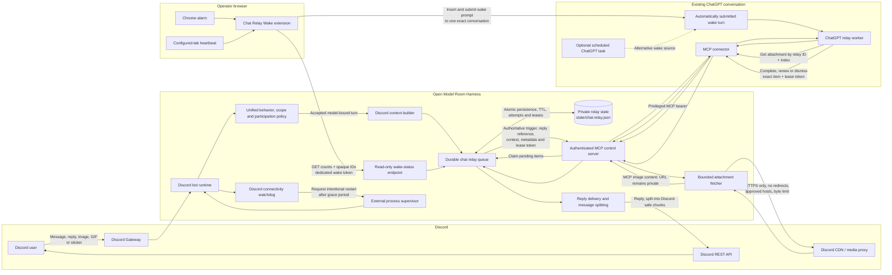

# ChatGPT Relay Architecture

Spanish version: [Arquitectura del relay de ChatGPT](chatgpt-relay-architecture.es.md)

This document describes the provider-free Discord-to-ChatGPT relay, its trust
boundaries, and the security implications of connecting a persistent ChatGPT
conversation to the harness through MCP.

## Executive conclusion

The harness does **not** automatically receive or read the full ChatGPT
conversation transcript. MCP exposes named tools with structured arguments, and
the current server implements tools rather than a transcript or conversation
export resource.

However, it is not correct to say that ChatGPT conversation content can never
leak through the harness. A model can place any text available in its context or
memory into an MCP tool argument. The harness currently has tools that deliver
such text to Discord, including relay completion and general scoped-send tools.
The worker contract reduces accidental cross-conversation contamination, but it
is a model instruction rather than a deterministic information-flow boundary.

The practical conclusion is:

- **No passive transcript access:** the current harness cannot silently request
  or download the entire ChatGPT history.
- **Possible model-mediated disclosure:** ChatGPT can send remembered or earlier
  chat content through an MCP text argument.
- **Possible extension compromise:** the current extension does not scrape chat
  messages, but a modified content script has DOM access on ChatGPT pages.
- **Separate OpenAI retention boundary:** ChatGPT retention, memory, and training
  controls are account/workspace properties; they are not controlled by the
  harness.

## Architecture

## Message lifecycle

1. **Discord ingestion.** The harness receives a Discord event and evaluates the
   unified behavior policy, Discord scope, participation limits, authorization,
   and maintenance state.
2. **Durable queueing.** With `MODEL_PROVIDER=none`, the harness does not call an
   LLM. It stores a bounded relay item containing the trigger, Discord identity,
   referenced-message context, recent Discord context, and private attachment
   references.
3. **Wake detection.** The extension polls the wake-status endpoint. The endpoint
   returns only counts and opaque relay IDs. Chrome alarms provide the normal
   trigger; a heartbeat from the configured ChatGPT tab supplements delayed
   Manifest V3 alarms.
4. **ChatGPT activation.** The extension inserts a fixed worker prompt into one
   configured ChatGPT conversation. A scheduled ChatGPT task can be used as an
   alternative wake source.
5. **Atomic claim.** ChatGPT calls `claim_chat_relay_items`. The harness leases
   each item to one worker and returns a lease token.
6. **Authoritative context.** The claimed relay item identifies the exact Discord
   trigger, reply reference, bounded context, attachments, and required relay ID.
7. **Image retrieval.** ChatGPT requests an attachment by relay ID and index. The
   harness resolves the private Discord URL, rejects redirects, validates the
   host and MIME type, enforces timeout and byte limits, and returns MCP image
   content.
8. **Completion.** ChatGPT completes, renews, or dismisses the exact leased item.
   Before delivery, the harness rechecks the current behavior policy and splits
   long text into Discord-safe messages.
9. **Recovery.** Pending work survives process restarts. Expired leases become
   pending again, failed delivery is bounded by attempt limits, and old work is
   removed according to TTL.

## Research: can the harness leak ChatGPT conversations?

### Threat model

The question has four different meanings that should not be conflated:

1. Can the MCP server automatically read the whole ChatGPT transcript?
2. Can ChatGPT voluntarily or accidentally place earlier-chat content in a tool
   argument?
3. Can the browser extension inspect the ChatGPT page?
4. Does OpenAI retain or use the ChatGPT conversation independently of the
   harness?

### Evidence matrix

| Question | Evidence | Finding |
| --- | --- | --- |
| Does MCP automatically send the complete transcript to the harness? | Official OpenAI documentation describes MCP tool calls as discovery followed by model-selected structured arguments and a server result. The current server registers tools with schemas and does not expose a ChatGPT-history resource. | **No evidence of passive transcript access.** The server receives tool calls and their arguments, not an automatic conversation dump. |
| Can prior ChatGPT content reach the harness? | `complete_chat_relay_item`, `submit_chat_relay_reply`, `send_owner_dm`, and `send_scoped_discord_message` accept model-generated strings. The server cannot determine whether those strings came from the Discord relay item, the current ChatGPT turn, an earlier turn, or ChatGPT memory. | **Yes.** The model can disclose prior context through a tool argument. |
| Can disclosed content leave the harness? | Relay completion sends the supplied `reply` to the triggering Discord channel. General send tools can send supplied text to an owner DM or an allow-listed Discord scope. | **Yes, within configured Discord destinations.** Scope checks constrain destination, not semantic origin. |
| Does the wake endpoint expose conversation content? | `/api/chat-relay/wake-status` returns enabled state, counts, and opaque IDs. It uses a dedicated token separate from the privileged MCP bearer. | **No content exposure through wake polling.** Timing and queue volume remain observable. |
| Does the current extension scrape ChatGPT messages? | The content script locates the composer, send/stop controls, and counts user-message elements only to confirm submission. It does not collect message text or send transcript data to the harness. | **No in the reviewed implementation.** |
| Could the extension scrape messages if compromised or modified? | Its manifest injects a content script into `chatgpt.com` and `chat.openai.com`. Content scripts can inspect page DOM available to them. | **Yes, as a capability risk.** The current source does not exercise that capability. |
| Can ChatGPT bring information from other chats into the relay chat? | Official OpenAI documentation states that ChatGPT memory can carry useful context from earlier work into future work and can be controlled in Settings. | **Yes, when memory/personalization makes that context available.** A dedicated conversation alone is not a hard isolation boundary. |
| Does the relay state contain ChatGPT transcripts? | `ChatRelayQueue` persists Discord trigger text, Discord context, reply references, attachment URLs, lease state, and metadata. The submitted ChatGPT reply is delivered and the item is removed; no ChatGPT transcript-fetch path exists. | **No complete ChatGPT transcript is intentionally stored.** The state file still contains sensitive Discord data. |
| Do normal MCP send audit records store message bodies? | Current audit events store destination metadata, status, and message length rather than the raw outgoing body. | **Normally no.** Raw error objects may still contain provider request details on failures and should be sanitized. |
| Is OpenAI-side chat retention the same as harness leakage? | Official connector guidance says non-synced connector data is processed transiently but normal chat-retention controls still apply. It also documents no model training on plugin-accessed information for Business, Enterprise, and Edu. | **No.** OpenAI account/workspace retention and training controls are a separate trust boundary. The cited guarantee should not be generalized to personal plans without checking their current data controls. |

### Code evidence

- MCP tools and their schemas: [`src/mcp-control-server.js`](../src/mcp-control-server.js)
- Relay item persistence, leases, worker contract, and completion:
  [`src/chat-relay.js`](../src/chat-relay.js)
- Discord policy checks and final delivery: [`src/discord-bot.js`](../src/discord-bot.js)
- Current DOM behavior: [`extensions/chat-relay-wake/content.js`](../extensions/chat-relay-wake/content.js)
- Wake polling and exact-task targeting:
  [`extensions/chat-relay-wake/background.js`](../extensions/chat-relay-wake/background.js)
- Extension permissions: [`extensions/chat-relay-wake/manifest.json`](../extensions/chat-relay-wake/manifest.json)

### Official evidence

- [OpenAI MCP server documentation](https://developers.openai.com/plugins/concepts/mcp-server)
  describes tools as functions called with structured model-supplied inputs and
  recommends authenticated HTTPS transport for private data and actions.
- [OpenAI plugin security and privacy guidance](https://developers.openai.com/plugins/guides/security-privacy)
  recommends least privilege, minimal structured content, bounded retention,
  redacted logs, server-side validation, and defense against prompt injection.
- [ChatGPT MCP documentation](https://learn.chatgpt.com/docs/extend/mcp)
  documents remote MCP tools, bearer/OAuth authentication, and the separation
  between hosted ChatGPT tools and local MCP configuration.
- [ChatGPT memory documentation](https://learn.chatgpt.com/docs/customization/memories)
  confirms that memory can carry context from earlier work into future work and
  explains the available personalization controls.
- [ChatGPT plugin and connector controls](https://learn.chatgpt.com/docs/enterprise/apps-and-connectors)
  documents connector permission layers, transient non-sync processing, normal
  chat retention, and the Business/Enterprise/Edu training statement.

### Current mitigations

- The wake extension uses a dedicated read-only wake token, never the privileged
  MCP bearer.
- Remote wake URLs require HTTPS; HTTP is limited to loopback and redirects are
  rejected.
- Wake status returns only counts and opaque IDs.
- Relay items and wake prompts state that the claimed Discord item is
  authoritative and unrelated ChatGPT history must be ignored.
- Lease tokens bind completion to one exact claimed item.
- General Discord sends are constrained to configured scopes, owner identities,
  and server-side validation.
- Attachment retrieval accepts a relay ID and index, not an arbitrary URL.
- Discord CDN/proxy host allow-listing, HTTPS, no redirects, MIME checks, timeout,
  count limits, and byte limits reduce SSRF and resource-exhaustion risk.
- Audit events for outgoing MCP messages record length and destination metadata,
  not message bodies.
- Relay content is bounded by TTL, queue size, context size, and attempt limits.

### Residual risk and recommended hardening

The strongest remaining risk is that the same privileged MCP surface exposes
both relay-specific tools and general Discord send/control tools. Prompt
instructions do not provide deterministic data-loss prevention.

Recommended next steps, in priority order:

1. **Create a relay-only MCP credential and tool surface.** Expose only claim,
   get, attachment, renew, complete, and dismiss tools to the ChatGPT relay
   worker. Keep general messaging, memory, behavior, scope mutation, and restart
   tools behind a separate credential or endpoint.
2. **Disable ChatGPT memory for the worker conversation** where account/workspace
   controls permit it, and use a dedicated conversation or project containing no
   unrelated sensitive discussion.
3. **Add deterministic outbound content controls.** Reject known secret formats,
   canary values, and unexpectedly large or unrelated outputs before Discord
   delivery. This cannot perfectly classify private prose, but it catches common
   credential leakage.
4. **Sanitize logged exceptions.** Log error name, status, correlation ID, and
   destination metadata rather than raw SDK error objects that may include
   request payloads.
5. **Reduce extension privilege.** Keep it unpacked and reviewed, distribute it
   from a controlled source, and consider runtime injection only into the exact
   configured task rather than a persistent content script across ChatGPT pages.
6. **Treat the relay ChatGPT account as a privileged service identity.** Use
   strong authentication, minimal workspace access, regular token rotation, and
   incident procedures for both the MCP bearer and browser session.
7. **Add adversarial tests.** Include prior-chat canaries and Discord prompt
   injections, then verify that no unrelated canary reaches any MCP send or relay
   completion argument.

## Security annex

| Risk | Implication | Current mitigation | Status / residual risk |
| --- | --- | --- | --- |
| Extension token theft | An attacker could observe relay activity and trigger checks. | Dedicated read-only wake token; privileged bearer excluded. | **Mitigated.** Counts and timing remain visible. |
| Remote credential interception | Wake or MCP credentials could be captured. | HTTPS remotely, loopback-only HTTP, redirects rejected. | **Mitigated**, subject to tunnel/TLS security. |
| MCP bearer compromise | Broad control over Discord, behavior, memory, and runtime tools. | Authentication and server-side validation. | **Open architectural concentration risk.** Split relay and administrative surfaces. |
| Cross-chat disclosure by the model | Earlier chat or memory content could enter a send argument. | Authoritative-item worker contract and exact relay binding. | **Partially mitigated.** Prompt compliance is probabilistic. |
| Prompt injection from Discord/images | Untrusted input could induce unrelated tool calls. | Untrusted-context instructions, schemas, scopes, lease checks, bounded tools. | **Partially mitigated.** Relay-only tool exposure is recommended. |
| Content-script compromise | A modified extension could scrape ChatGPT DOM. | Small reviewed source, exact target check, no transcript code. | **Residual capability risk.** Browser/session integrity matters. |
| SSRF through attachments | The model could fetch internal or arbitrary URLs. | ID/index interface, approved Discord hosts, HTTPS, no redirects. | **Mitigated.** |
| Oversized media | Memory/bandwidth exhaustion. | Count, byte, stream, timeout, MIME, and TTL limits. | **Mitigated**, with bounded resource cost. |
| Duplicate replies | Concurrent workers could answer twice. | Atomic claims and lease-token validation. | **Mitigated**, except ambiguous external delivery failures. |
| Private data at rest | Relay state contains Discord text and signed attachment references. | Private local state, atomic writes, bounded TTL and queue size. | **Residual host-access risk.** Protect backups and filesystem permissions. |
| Sensitive payloads in logs | Failed provider calls could expose content in raw errors. | Structured audit events avoid normal message bodies. | **Partially open.** Sanitize raw exceptions. |
| Silent Discord outage | Work queues while delivery is unavailable. | Optional watchdog and external supervisor. | **Mitigated when correctly deployed.** |
| ChatGPT retention/training | Chat and connector data remains subject to plan/workspace controls. | OpenAI workspace and data controls; Business/Enterprise/Edu connector training statement. | **External trust boundary.** Verify the actual account plan and settings. |

## Operational security baseline

- Use distinct, high-entropy values for `MCP_CONTROL_BEARER_TOKEN` and
  `MCP_CONTROL_WAKE_TOKEN`.
- Never place the privileged MCP bearer in the extension.
- Keep MCP behind a trusted HTTPS tunnel or private deployment boundary.
- Configure only the Discord scopes the worker genuinely needs.
- Protect `state/chat-relay.json`, configuration, logs, and backups as sensitive
  data.
- Use a dedicated ChatGPT worker conversation with memory disabled where
  possible.
- Do not put secrets or unrelated private discussions in the worker chat.
- Keep relay retention no longer than operationally necessary.
- Review MCP audit metadata and failed-authentication events.
- Rotate credentials and invalidate the ChatGPT browser session after suspected
  compromise.

The design principle is: **the extension only wakes, ChatGPT decides, and the
harness remains authoritative for queue ownership, policy, and Discord
delivery.** That limits passive exposure, but deterministic isolation requires a
relay-only MCP surface in addition to prompt-level instructions.
